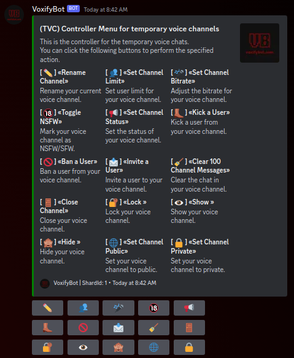

# Advanced Setup

You can setup a #controller channel in your discord server to allow users to access a central point of voice channel management.

To generate a controller message first setup the basic functionality of the bot.

See: [Getting Started](getting-started.md)

When that is done you can join the Lobby to create a temporary voice channel. You're getting move into the channel. After that you can generate a controller menu in a channel of your choice.

Use: `/controls show:True`

Then the Bot replies to the channel with a controller menu like this\

Enjoy the temporary voice channels experience. :)

